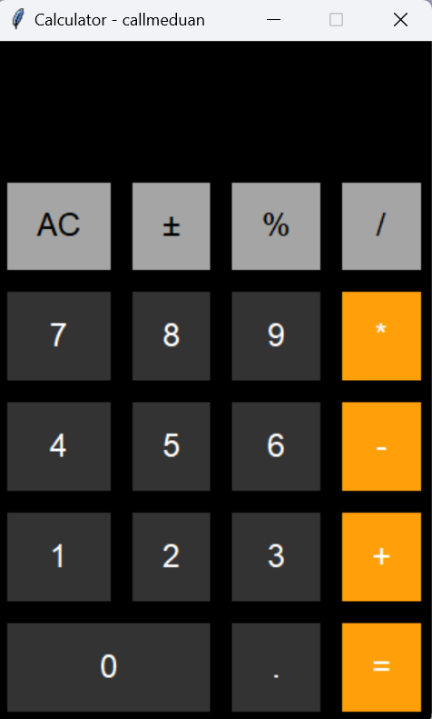

# 🍎 iOS Style Calculator (Python)

A modern calculator inspired by the iOS design, built with Python and Tkinter.
Clean UI, dark mode, and a minimal layout just like the iPhone calculator.

---

## ✨ Features

* 🎨 **iOS-style interface**
* 🌙 Elegant dark mode
* 🔢 Basic operations (+, −, ×, ÷)
* ⚡ Instant results
* 🧠 Clean and structured code (OOP)

---

## 🛠️ Tech Stack

* Python 3
* Tkinter

---

## ▶️ Run the App

```bash
python main.py
```

---

## 📸 Preview



---

## 👨‍💻 Author

Built to improve Python and GUI development skills.

---

⭐ If you like it, consider giving it a star!
